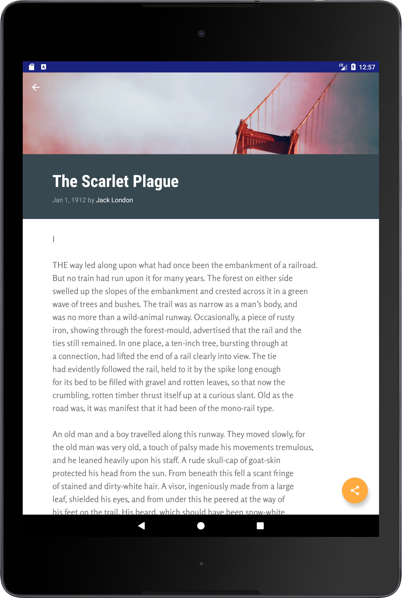
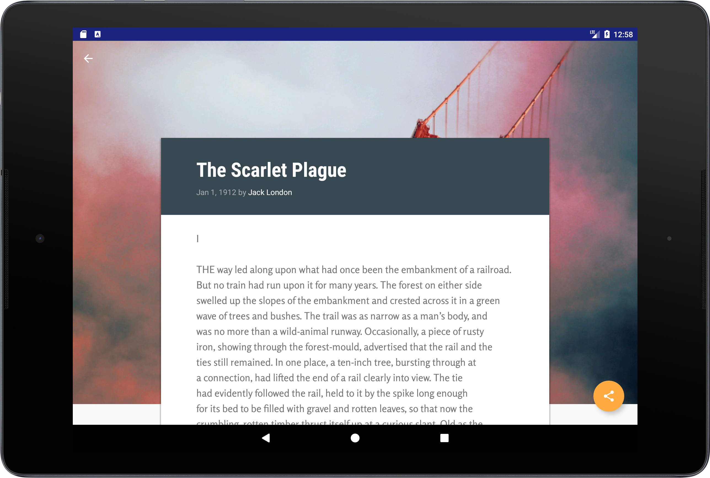
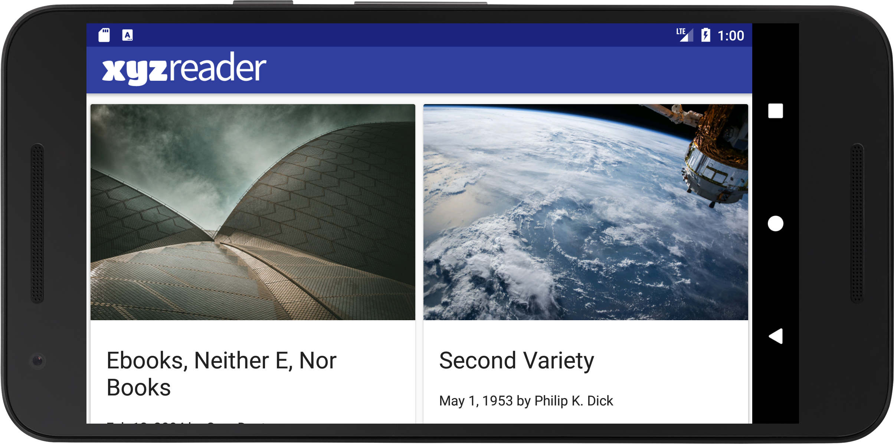

# Make_Your_App_Material

Redesigned an existing app called [XYZReader](https://github.com/udacity/xyz-reader-starter-code) to follow the Material Design guidelines and translate a set of static design mocks to a living and breathing app. This is a Project 5 of [Udacity's Android Developer Nanodegree](https://www.udacity.com/course/android-developer-nanodegree-by-google--nd801).

## Inside this app:

- Fundamentals of Android design and Material Design guidelines are applied
- Interfaces are separated into surfaces
- Simple transitions and motions are used (Content transitions, Collapsing Toolbar)

## Why this Project?
This project gives you an opportunity to improve an app’s design, a vital skill for building apps users will love. It also replicates a common developer task of updating and changing an app's design as new standards are released.

# Screenshots

 </img>  </img>
 </img> 

 </img>

# Developer Setup

Clone or download this repository.

## Requirements
- Java
- Latest version of Android Studio, Android Build Tools, Gradle

# Author
[Denis Dávidek](https://github.com/DenisDavidek)
